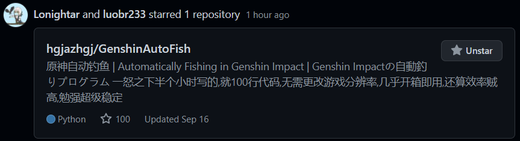

> 笑死,鱼塘里根本没有鱼  

**本项目在2021年9月24日被GitHub删了,现将其恢复**  

热烈庆祝本项目在2021年9月18日获得100star!  
  

非国服玩家需修改config.json中的"title"为你自己的原神窗口标题  
# 原神智能钓鱼
大幅延长你的鼠标寿命  
先启动原神,然后以管理员身份运行本程序,程序就会在检测到鱼上钩时智能收杆  
这个程序只能帮你收杆,不能帮你找鱼/换饵/放杆  
  
设置抗锯齿算法为SMAA来避免一些游戏背景的干扰  
游戏分辨率理论无限制,但相对720p非简单整数比缩放或者画面太小估计就不能用了,坐标什么的都是写死了的  
程序需要管理员权限,否则PostMessage无权访问  
输入焦点必须在原神窗口内,否则游戏不响应输入事件  
一时兴起写的,起因是9月6日晚上一条观赏鱼钓了我两分钟,手都快抽筋了,一怒之下写了个这个,得益于FGO-py带来的图像识别游戏程序的设计经验,最初的commit只用了半个小时开发,半个小时测试  

如果你觉得这个程序的表现太好了,首先来点一个star,然后可以考虑在config.json中打开笨拙模式开关  


## 更新日志
## 2021/10/06
偷偷恢复一个自动打包,再观望一下看看形势  
## 2021/09/25
本项目在2021年9月24日被GitHub以`using GitHub as a platform for propagating abuse on other platforms`理由关闭  
经过一晚上的复盘,我将原因定位到了我写的**英文readme**上,以至于GitHub对其进行了NLP分析  
现本项目恢复,并移除了非中文的readme,移除了workflow,并对一些词语进行了混淆  
## 2021/09/21 v2.3.0
更新:在原神关闭后程序智能退出  
这个[全智能钓鱼](https://github.com/7eu7d7/genshin_auto_fish)未来可期,等它完善了本项目就可以archive了  
## 2021/09/14 v2.2.0
又要凹深渊了...  
更新:外服的原神窗口标题当然不是原神  
更新:全分辨率适配无法保证100%正确  
因此这两项对应的数据已经写在config里面可以手动更改,每次分辨率兼容性bug都要改代码重新打包也太tm蠢了  
## 2021/09/14 v2.1.2
bugfix(?):[issue 14](https://github.com/hgjazhgj/GenshinAutoFish/issues/14)  
这个原神的ui布局问题属是有点搞人心态...  
更新:修改了保存截图的格式  
## 2021/09/13 v2.1.1
bugfix(?):[issue 13](https://github.com/hgjazhgj/GenshinAutoFish/issues/13)  
之前的feature基于原神的bug...  
优化:张力区间显示优化  
## 2021/09/13 v2.1.0
更新:根据[issue #12](https://github.com/hgjazhgj/GenshinAutoFish/issues/12)优化了截图处理算法,并重新制作了模板图片  
bugfix:对于偏方形的画面正确截图  
## 2021/09/12 v2.0.0
更新:由收杆的图标而非文字提示来判断是否收杆,以适配多语言版本  
添加了日语和英语的readme  
另:现在默认无需案按键启动,因为我觉得现在不会在其他场景误判上钩  
尽管我进行了些许测试来调整识别阈值,但应该还是存在些许场景会干扰识别
现在每次截图都会重新获取分辨率,以在设置了不按键启动时能热更改游戏分辨率,同时也避免了窗口即将来到前台,但还没有来到前台,是foreground window但rect=0的偶然情况  
改换收杆判断有一个意想不到的好处--你可以一条鱼钓到一半切出原神看看qq消息什么的再立刻切回来继续钓  
## 2021/09/12 v1.8.1
上个版本中的游戏版本号忘记改了...  
优化:性能优化,1.8.0中的图像透明度融合使得截图时间翻了7倍....
因为我有足够好的cpu所以在测试的时候根本没注意到这个问题,我已经调整了我的算法  
优化:笨拙模式有更高的概率能钓到鱼  
## 2021/09/11 v1.8.0
更新:调整整个截图识别的流程,在v1.5.0的基础上增强兼容性  
感谢[Mufanc](https://github.com/Mufanc)在本项目的[issue #10](https://github.com/hgjazhgj/GenshinAutoFish/issues/10)中提出的想法  
## 2021/09/11 v1.7.1
更新:config中可设置系统缩放倍率,仅在主显示器与原神所在的显示器的缩放倍率不同时才需填写  
避免原神所在显示器与主显示器缩放倍率不同时截图错误  
主要是懒得写多屏适配了,并且还存在着原神跨显示器的情况  
事实上,如果随便给你一个窗口,你没有办法知道这个窗口使用了怎样的缩放 [MSDN](https://docs.microsoft.com/zh-cn/windows/win32/hidpi/high-dpi-desktop-application-development-on-windows)  
bugfix:正确保存截图  
优化:等待原神窗口来到前台再开始截图识别  
避免没有设置按键开始时启动本程序时截图报错  
优化:在识别到鱼儿上钩后增加少许延时再提杆
笨拙模式下该延时会随机延长  
优化:增加了一些输出  
优化:把config.json中的文档链接换成了微软官方机翻的中文版本  
更新了ISSUE_TEMPLATE  
## 2021/09/10 v1.7.0
更新:活动挑战的倒计时图标导致张力区间条下移,扩大了识别区间  
## 2021/09/09 v1.6.3
优化(?):拿了个try把代码包了起来,以防极少情况下闪退看不清输出  
bugfix:带窗口类名查找窗口  
这原神的启动器窗口标题也叫原神  
## 2021/09/09 v1.6.2
优化:笨拙模式现在看起来确实笨拙  
优化:避免连续保存截图  
优化:调整游标偏移  
## 2021/09/09 v1.6.1
bugfix:拼写错误  
不会吧不会吧,加个随机延时都能写出bug  
## 2021/09/09 v1.6.0
更新:可以让程序的表现不那么好,显得真实  
具体来说就是点按和等待都加一个随机化的延时  
虽然该封号还是得封  
## 2021/09/09 v1.5.1
bugfix:指定图像缩放算法  
增强有缩放时的识别准确率  
## 2021/09/09 v1.5.0
更新:现在亮色的背景不再会干扰识别了!  
从根本上解决了这个问题  
## 2021/09/09 v1.4.0
更新:适配非16:9分辨率,真正做到「无需任何配置」  
## 2021/09/08 v1.3.1
bugfix:正确打包config.json  
优化:缩短了单次点按的时间  
## 2021/09/07 v1.3.0
更新:设置按键启动为可配置项  
## 2021/09/07 v1.2.0
更新:对所有16:9的画面进行缩放,不再强制限定1280*720  
更新:添加了应用图标,随便网上找来的  
## 2021/09/07 v1.1.0
更新:可视化张力区间与游标位置并动态刷新,如下所示  
```[__________________<_____|__>______]```
## 2021/09/07 v1.0.0
添加智能release  
更新:在确定鱼即将咬钩时按下SCROLL LOCK键来触发智能钓鱼,以免其他场景干扰识别  
更新:适配不同系统缩放比例  
优化:性能提升  
优化:在游标处于端点时提高识别准确度  
优化:识别参数调整  
